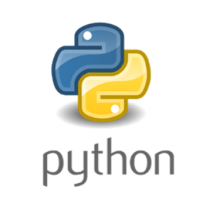

### Hi there 👋 
# ✨  I'm Jose Salas 

From the backend I develop infrastructure and services with technologies such as python `(*.py)` and golang `(*.go)`, 
I have had the opportunity to work in many 🦾 industries, in each development team 👨‍💻 I leave my mark and beautiful friendships. I also love to learn and teach 🤓

- 🔭 I’m currently working on @mercadolibre
- 🌱 I’m currently learning new stuff
- ✊ My strong skills are in python

